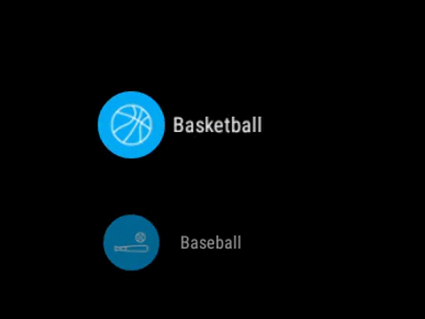

# Wearable Listview Example

Simple example showing how to use WearableListview for Android Wear.
Implements OnCenterProximityListener interface to change view style when focus on some list items 

# Icons by Norbert Kucsera
You can download his icons collection from The Noun Project website [https://thenounproject.com/idiotbox/collection/sports/](https://thenounproject.com/idiotbox/collection/sports/)
